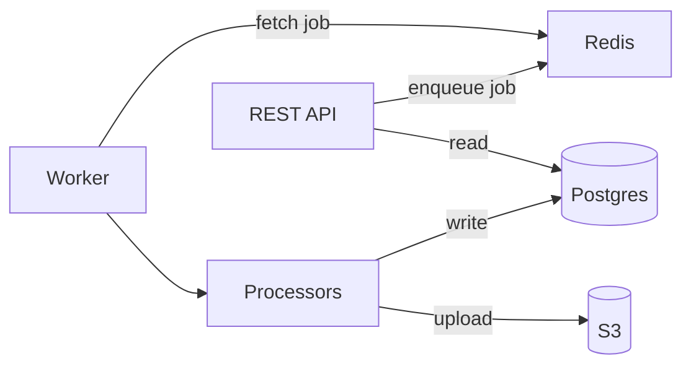

<h1 align="center">🐎 Hoof 🐎</h1>

This repository contains backend services for the [Playful Programming](https://playfulprogramming.com/) website and (future) content management system.

## High Level Architecture

The REST API is the external interface for Hoof, which handles tasks via enqueuing to Redis. Tasks are pulled from Redis via the worker. The worker spawns worker threads done to avoid overburdening with CPU and memory intensive tasks



## Development

### Prerequisites

- Node.js 22
- Docker
- pnpm 10.6.1

### Quick Start

Install the project dependencies:

```bash
pnpm install
```

Set up secrets & environment variables:

```bash
cp .env.example .env
```

Start background services:

```bash
docker compose up -d
```

Run the dev server:

```bash
pnpm dev
```

Once it's running, you should see the API documentation hosted at `http://localhost:3000/docs/`. This can also be used to test the endpoints!

#### Testing in Docker

To test the server in its docker container, instead of running `pnpm dev`, you can build & start the docker image with:

```bash
docker compose --profile=app watch
```

## Roadmap

- Manage tasks for post image & metadata generation (initial deployment)
- Index & sync post content from the [main repository](https://github.com/playfulprogramming/playfulprogramming/)
- Provide APIs to query that content on-demand (so that playfulprogramming can switch to SSR)
- Enable user accounts & login
- Provide APIs to directly create and edit site content
